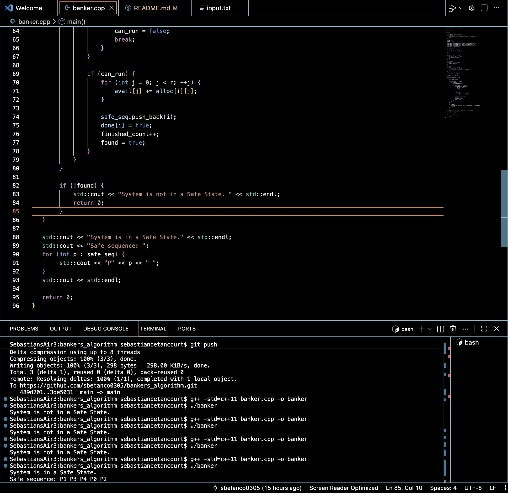

# bankers_algorithm

##Topic
**Deadlock**
Deadlock is a situation where two or more processes are stuck indefinitely, each waiting for resources that other process in the same group are currently holding. 
The Banker's Algorithm is used to avoid deadlock by ensuring that the system only enters a "safe state"

##Program description
The project consists of a banker.cpp file that reads an input.txt containing the following matrices: 
- 'Allocation' matrix
- 'Max' matrix
- 'Available' vector

The bancker.cpp contains the implementation of the Banker's Algorithm. 
Step 1: Reading input from an input file
        - Program reads n (# of processes), and r (# of resources)
        - Then reads: 'Allocation' matrix, 'Max' matrix, 'Available' vector
Step 2: Computing the Need Matrix (how many resources a process needs to finish)
        - Calculation: need[i][j] = max[i][j] - alloc[i][j]
Step 3: Check Safe State (Banker's Algorithm)
        - Find process Pi such that need[i][j] <= Available[j]
        - If found: 
                    - Process can run safely
                    - Allocated resources are returned to Available vector
                    - Process added to safe sequence
                    - Marked as finished
        - If no process can run at any step then the system is not safe
Step 4: Output
        - If process can finish: 
                                - Program prints: "System is in a Safe State"
                                - Program prints: "Safe sequence: (safe sequence. E.g., P1 P3 P4...)"
        - If process cannot finish (not safe):
                                - Program prints: "System is not in a Safe State"

##Input File
The 'input.txt' file must follow the following format: 
n r
<allocation matrix rows>
<max matrix rows>
<available vector>
Where: 
- **n** = number of processes
- **r** = number of resources
Example used: 
5 3
0 1 0
2 0 0
3 0 2
2 1 1
0 0 2
7 5 3
3 2 2
9 0 2
2 2 2
4 3 3
3 3 2

Libraries used: 
* '<iostream>' - basic input output operations
* '<vector>' - dynamic arrays for matrices
* '<fstream>' - reading input from a file

Usage Instructions: 
**program compilation**
'''bash
g++ -std=c++11 banker.cpp -o banker
**run program**
./banker

Results: 
        